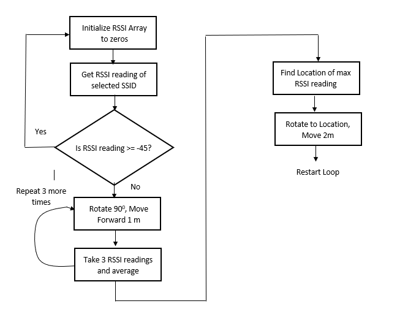
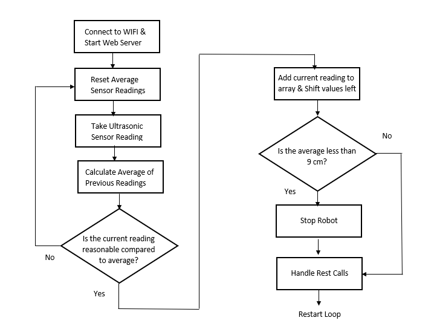
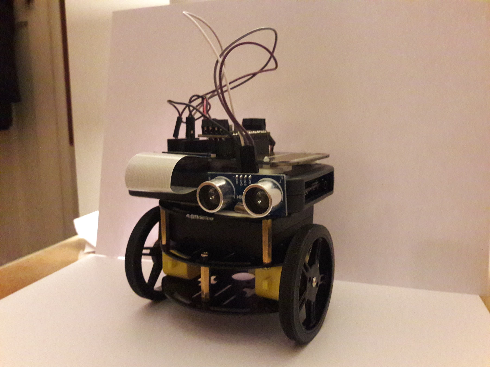

My Project Documentation
===

# Design

Our chosen project makes use of the Adafruit “Tri-layer Mini Round Robot Chassis Kit” as can be seen here: https://learn.adafruit.com/tri-layer-mini-round-robot-chassis-kit/assembly. Our robot will first of all connect to a wireless hotspot and once it has established a connection attempt to move towards it. This will be done by testing the RSSI connection strength recorded when moving in different directions. The RSSI or “received signal strength indicator” is a measurement of how well a device can hear a signal from an access point or router. The range of values that RSSI uses to rate signal strengths uses a scale between 0 and -100 dBm.  From the research we have conducted regarding RSSI signal strengths, a good connection is anything above -67 dBm, which is referred to the a the minimum value required for applications that require reliable, timely delivery of data packets such as VoIP and video streaming.

In order to move towards the hotspot location the robot will as mentioned previously move in different directions and take an RSSI reading of the current hotspot it is following for each direction. It will then compare the recorded values and move in the direction containing the strongest signal strength. This process will be repeated until the robot has eventually achieved a signal strength that is above a certain threshold associated with a good signal connection. One concerning factor that we will account for when the robot is moving in the various directions is objects blocking it’s path. To handle this we will attach an ultrasonic sensor to the expander board that will allow us to take continuous distance readings. Using these distance readings we will stop the device if it becomes too close to any objects it is moving towards to prevent damage being sustained.

Another piece of functionality that we intend to add is the ability to change the hotspot that the device is currently following. This will allow the robot to start moving towards a new device after it has stopped or re-route it from the current hotspot it is attempting to find. We intend for this to be possible by allowing the user to connect to an access point hosted by the robot which that makes use of a web portal to capture user requests. 

Speech is perhaps considered to be the most natural form of human communication and in recent times has led to the rise of many forms of speech processing technologies. As such we would also like to incorporate voice interaction with our device to give it commands that can control movement and set the current hotspot the device is following. Initially when the program starts the user will be able to control the robot by voice, before giving it the name of a hotspot to follow, at which point it will carry out the process as described above.

# Functionality

When it came to implementing the design specification we came across an unsolvable problem relating to the hosting of web servers. This is because of two conflicting arduino libraries. The “ESPAsyncWebServer” library is used to handle the web portal responsible for setting the access point to follow so that web requests can be sent whilst the robot is carrying out its movement algorithm. However, the “WIFIServer” of the “WIFI.h” library is used to handle the commands made via speech because “aRest”, the library used to collect the URI of the voice input can only be used in combination with a server of this type. Although multiple instances of each of theses servers can be specified using port values, their server types cannot be used simultaneously. As soon as either of the server’s is accessed the device will not configure the other server. This has meant that we have had to seperate our functionality into two separate programs as described here.

### Access Point Follower 

Our access point following program begins by attempting to move towards the network that it first connects to when the device is initialized. If it reads an RSSI value of greater than -45 dBm then it will stop and it’s movement algorithm will not begin. On the other hand, if an RSSI reading of less than -45 dBM is read it will move onto the rest of its movement algorithm:

1. Take an RSSI reading, if it’s less than -45 dBM continue from step 2 else end the algorithm.

2. Move forward for a predefined distance then take an RSSI reading of the current network it is following.

3. Move backwards for the same predefined distance until it is back where it started.

4. Rotate by 90 degrees.

5. Repeat steps 2-4 an additional 3 times until four directions at 90 degree intervals have had measurements taken.

6. Comparing the recorded RSSI values, turn towards the direction of when the highest RSSI value was taken and move in that direction for a predefined distance.

The robot will repeatedly go through these steps to account for any change in the location of the networked device it is trying to follow and to account for a change in the hotspot it is set to follow. The hotspot it is set to follow can be changed by connecting to an access point created by the Robot device that hosts a series of webpages. These webpages allow a user to choose from a list of networks that the device has scanned as being accessible and set the new network to follow. 

**Figure 1a:  Access Point Follower  Main Program Loop Flow Diagram**

### Speech Enabled Movement 

The speech enabled movement program allows the robo car to be controlled using voice commands. The commands are sent via a web page which requires the user to press a record button, which then asks for the users permission for the web page to access the users microphone and capture audio. This is done for security reasons and is a standard to request access to potentially sensitive data at run time from the user. 

Once the user grants access to the microphone the user can issue a command and then press the button again to stop the audio recording. The user can choose from a set of preset commands which are as follows: forward, backward, left, right and stop. If the speech recognition algorithm detects any of the preset commands in the audio recording, it triggers the corresponding action to be carried out by the robot via a HTTP request. 

The forward and backward command will continually run until the user issues the stop command. We chose to do it this way as it gives the user more control over the robo car and doesn’t require them to keep repeating commands. The left and right functions, turn the robo car 90 degrees on the spot in the respective direction. The stop function causes the robot to cancel whatever function it is performing, and stops the motion of the robo car making it stationary.

Furthermore this program also makes use of an ultrasonic sensor that has been mounted to the front of the robo car. This sensor takes a reading each loop iteration, recording the distance to the closest surface directly in front of the robo car. If this sensor reading goes below a certain threshold ( which has been set to 9cm) the robot calls the stop function to prevent itself from crashing into the surface ahead.

**Figure 1b: Speech Enabled Movement Main Program Loop Flow Diagram**

# Implementation

In both of the following programs the “Adafruit_MotorShield” library was used to control the two motors. Moving the robot involved setting motor speeds and directions for each motor to spin. To make the robot move for predefined distances, we set the speeds of the motors and then apply a delay before setting the speeds of the motors back to zero. One thing to note in both of our programs is that the directions specified in the code are actually reversed e.g. when setting the two motors to move forward, the robot actually moves backwards. This has been accounted for in our movement methods.

### Access Point Follower 

The access point follower performs the operations as described above, in order to do this is must take RSSI readings. The RSSI readings are taken by scanning for all the networks currently accessible by the device using the “WIFI” library and then taking the RSSI value of the network that the robot is currently set to follow. To account for fluctuations in the reading of RSSI values, we take 5 readings in each direction before taking an average of those 5 readings and storing them an array associating that average RSSI value with the direction it took them from. Once all  4 directions have recorded average RSSI values in the array we simply find the index of the maximum value in the array. Using this index we rotate the robot 90 degrees by decreasing the inde value by 1 for each rotation until it reaches zero and is facing the direction in which the best average RSSI reading was calculated. Finally the robot moves in this direction before the algorithm restarts.

To change the network that the robot is moving towards a user connects to the access point hosted by the device and accesses its web server using the address “192.168.4.1”. From here a user can select to either view details concerning the network the device is currently connected to or choose to follow a new device. If they choose this latter option a list of all the available networks is listed on a webpage with corresponding radio buttons assigned to each one. To select a network it is simply a case of clicking the radio button next to the desired network and then clicking the submit button at the bottom of the page. Following this, the web server will return to the home screen and inform the user that they are now following their new chosen network. In order to handle all the requests on this webserver the “ESPAsyncWebServer” has been used so that HTTP requests can be handled asynchronously with current algorithm operations.

To help with code readability, separate header files have been included to organise the code in a logical manner. These are a header file containing the motor shield setup declarations and its movement methods and a header file for asyncwebserver related setup and methods.

### Speech Enabled Movement 

The code for the web page is separated into three different parts, the HTML, the javascript and the css. The HTML and css define the structure and the look of the web page, whereas the main logic is contained in the javascript file. In the javascript file, the robo car is registered as a new device with the ip address that is returned from the setup function in the serial monitor. 

Then the javascript file checks to see if the ‘webkitSpeechRecognition’ api is available in the browser that the user is currently using. At this current time the api is only provided by the Chrome and IE browsers. If the api is available it declares several functions which trigger on start, on end and on result. Once the user has pressed the record button, issued a command and pressed the button again, the on result function returns a string which is a transcript of the audio recording. Then the string is broken into an array of the words and converted to all lowercase to make matching the commands easier.

Then we loop over each of the words and check to see if each word matches any of the preset commands. If the word matches a command, it triggers the corresponding function using the aRest library. The aRest library builds a HTTP request with the function name as a parameter and sends it to the device IP. In the program loop, the aRest library handles the HTTP request to the server and from the function parameter in the request, calls the appropriate motor function. 

We have also implemented a watchdog timer in this program which checks for commands that the microprocessor should issue. As soon as the time since the last pulse exceeds our configured threshold, watchdog initiates a reset sequence. The reason why we implemented this feature is so that the program doesn’t lock up when it is waiting for a HTTP request. 

The algorithm that handles the ultrasonic sensor readings works by first initializing an array of 10 zeros. Then in each iteration of the program loop, the ultrasonic sensor takes a reading and compares it to the average reading of the 10 values that came before it. The program does several checks at this point to ensure that the reading just taken is a reasonable one, due to the fluctuating sensor readings. If the current sensor reading isn’t too far above or below the average reading then it is added to the last position of the array after shifting all values in the array to the left. 

Finally at the end of the program loop, we check to see if the average sensor readings are below a threshold value, and if so we call the stop function to prevent the robo car from crashing into the surface ahead.

### Robot Configuration

When it came to building the Robot Car we initially used the build instructions as described on the adafruit robot assembly webpage to build the chassis. The battery pack which is located at the centre of the chassis is held in place using double sided sticky tape and standoffs. The unphone is then attached to the top of the robot chassis again using double sided sticky tape. To connect the motors to the unPhone an expander board has also been attached which makes use of a serial wire to send instructions. The motors are attached to the ESP32 motor board along with power connections from the battery pack. The ultrasonic sensor is also connected to the expander board and headers have been used to make the pin connection. We have placed the ultrasonic sensor at the highest possible position on the robot so as to avoid misrepresentative readings that may be taken from the floor in front of the robot.

**Figure 3a: Picture of our final robot physichal configuration**

# Testing

Testing of the **Access point follower** consisted of the following tests:

1. Testing the rotation of the device by repeatedly altering the speed of the motors and the duration of the turning to achieve a 90 degrees rotation.

2. Testing the distance travelled by changing altering the speed of the motors and the duration of the movement to achieve distances appropriate to the space for demonstration.

3. Ensuring that the device connects to a network on initialization and creates an access point.

4. Checking that this access point can be connected to, serve web pages and allow the user to change the network the robot will follow.

5. Check that the web server can handle requests asynchronously during loop operations.

6. Checking that the robot is successfully taking five reading and calculating an average RSSI for each direction.

7. Ensuring the Robot rotates to the direction of when the best RSSI average was calculated and consequently moves in that direction.

8. Changing the network it follows after it has already moved toward the previous network it was it was set to follow.

9. Changing the network it follows whilst it is currently trying to move towards a different network.

Testing of **Speech Enabled movement** consisted of the following tests:

1. Testing that the string taken from the audio recording is correctly being mapped to its corresponding aRest function.

2. Checking that in cases where requests are not sent through (pending), the watchdog library restarts the aRest server so that subsequent requests can be handled.

3. Check that averages for the ultrasonic readings are not abnormal and that the measures we have taken to ensure this are working successfully.

4. Making sure the robot stops moving when it comes within a certain range of an object within its path.

5. Checked the network requests that are being sent via the web page to ensure they are sending to the correct IP address and with the correct url parameters.

6. Ensured that the webkitSpeechRecognition API had a high enough success rate when transcribing the audio commands.

# Security

When looking at how best to secure the device, we took into consideration methods to secure both the communications and the physical security of the device. In terms of the physical security of the device, there were several security concerns that should be addressed.

Firstly someone with access to the physical device would be able to boot it into flash mode and serially push their own application onto the device. One method we found to rectify this issue is to enable secure boot in the ROM bootloader. This method ensures that only our code can run on the device by generating a key that is stored in the flash.

Another physical security risk that we found is that somebody could dump the contents of the flash memory and get access to the passkeys that are stored in plain text, such as the SSID and the passkeys. To avoid this from happening we could enable flash encryption from the bootloader. However once this is enabled the hardware only allows 3 subsequent flash updates via serial, the rest must be done via an implementation that allows OTA updates. As this device is not going into a production environment we felt that it wasn’t necessary to enable these physical security features.

### Access Point Follower Security

One security measure that we implemented involves the user having to type in a password to connect to the devices access point. This means that no-one that does not have knowledge of the devices password will be able to change the network that the device is following and hence interrupt it’s operation.

Furthermore,  the Access point follower makes use of HTTP requests using an async web server one potential security measure we considered involves securing these communications using HTTPS with certificate pinning to make sure that the device can only receive requests from a trusted device. Moreover using the MQTT messaging protocol would be an ideal way to secure communications on this device. This is due to the fact that the protocol is designed for constrained devices with low bandwidth such as our ESP32.

### Speech Enabled Movement Security

The first security measure that was implemented for this program is that the web page requests access to the users microphone at run time. This requires the user to grant permission to the web page so that it can access the audio in order to perform the speech to text on the commands. This is important as it ensures the user is in full control of their potentially sensitive data and can enable / disable recording at any time. 

The next security feature that we have included is the use of the watchdog timer. The watchdog timer will trigger a reset if the main program doesn’t perform its necessary tasks within a given threshold. This is useful from a security standpoint as the program won’t get locked up and not respond to further requests given. If the program locked up, it may mean that the robo car continues in motion and could cause potential damage to the components on the robo car.
